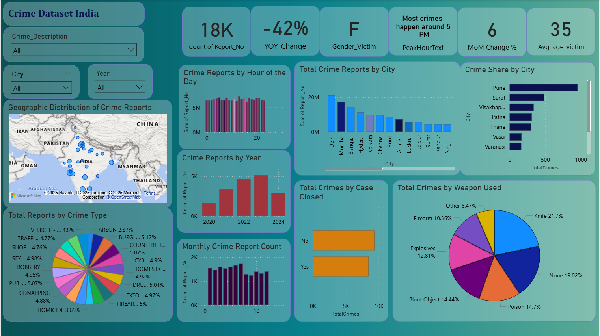

# Crime Analytics and Insights: A Data-Driven Approach

A comprehensive data analysis and visualization project aimed at uncovering crime patterns and trends across various Indian cities. This project integrates **Power BI** for interactive dashboarding and **Python (Pandas, Matplotlib, Seaborn)** for Exploratory Data Analysis (EDA) to provide actionable insights for law enforcement and public safety.

## � Project Overview

Crime analysis is vital for developing effective law enforcement strategies and public safety policies. This project analyzes 18,000+ crime reports to identify hotspots, temporal patterns, victim demographics, and law enforcement efficiency.

## �📊 Dashboard Overview

The Power BI dashboard serves as the central hub for visualizing complex crime data.

### 📈 Key Performance Indicators (KPIs)
- **Total Reports**: **18K+** incidents recorded.
- **YOY Change**: **-42%** decrease, suggesting potential improvements in crime control or changes in reporting.
- **MoM Change**: **+6%** increase from the previous month, highlighting recent trends.
- **Peak Hour**: **5 PM**, indicating a critical window for patrolling and public vigilance.
- **Victim Demographics**: 
  - **Most Common Gender**: Female (F).
  - **Average Victim Age**: 35 years.

## 🔍 Detailed Insights & Findings

### 🌍 Geospatial Analysis
Crime incidents are heavily concentrated in major urban centers, reflecting a correlation between urbanization and reporting rates.
- **Delhi**: Leading with **27.3%** of total crime share.
- **Mumbai**: Followed by **18.5%**.
- **Emerging Clusters**: Significant shares in **Pune (22.8%)**, **Surat (16.6%)**, and **Visakhapatnam (11.3%)**.

### ⏰ Temporal Trends
- **Peak Crime Window**: **5 PM to 8 PM** accounts for the highest volume of incidents.
- **Least Active Hours**: Late night and early morning show minimal activity.
- **Yearly Trend**: A steady increase was observed until 2023, followed by a slight decrease in 2024.

### ⚔️ Crime Categories & Weaponry
- **Top Offenses**: Burglary, Cybercrime, Robbery, and Sexual Offences are the primary concerns.
- **Weapon Distribution**:
  - **Knife**: 21.7% (Most prevalent)
  - **Poison**: 14.7%
  - **Blunt Objects**: 14.4%
  - **Explosives**: 12.8%
- **Case Resolution Status**: Nearly **50% of cases remain open**, indicating a significant gap in case closure efficiency.

## 📂 Dataset Description

The analysis is based on the [crime_dataset_india.csv](crime_dataset_india.csv) dataset, which includes the following key features:
- `Report Number`: Unique identifier for each incident.
- `Date/Time of Occurrence`: Used for temporal trend analysis.
- `City`: Geographical location of the crime.
- `Crime Description`: Detailed category (e.g., Theft, Assault, Cybercrime).
- `Victim Age & Gender`: Demographic details of the victims.
- `Weapon Used`: Type of weapon involved in the incident.
- `Crime Domain`: Classification of crime (Violent, Property, Cyber, etc.).
- `Police Deployed`: Level of law enforcement response.
- `Case Closed`: Binary indicator of the case status.

## ⚙️ Methodology

### 1. Exploratory Data Analysis (Python)
- **Data Cleaning**: Handled missing values, formatted dates, and normalized categorical data.
- **Statistical Analysis**: Analyzed correlations between victim age, time of occurrence, and crime types.
- **Visualization**: Used Seaborn and Matplotlib to create initial trend plots.
[🔗 View EDA Notebook on Colab](https://colab.research.google.com/drive/10FrDg9gya1RFFzS21JGTfUTDrLFZNtoI?usp=sharing)

### 2. Dashboard Development (Power BI)
- **Data Modeling**: Created relationships between various data tables for seamless filtering.
- **Interactive Slicers**: Enabled filtering by **City**, **Year**, and **Crime Description**.
- **Geospatial Mapping**: Used Map visualizations to identify high-density crime zones.

## 💡 Strategic Recommendations

- **Targeted Patrolling**: Increase surveillance in **Delhi** and **Mumbai** during peak hours (**4 PM – 8 PM**).
- **Urban Resource Allocation**: Prioritize resources in **Pune** and **Surat** where crime levels are disproportionately high.
- **Cyber-Security Focus**: Enhance digital policing infrastructure to address the high volume of cybercrimes.
- **Public Awareness**: Launch campaigns targeting the 30-40 age demographic and focus on gender-specific safety programs.
- **Efficiency Improvement**: Streamline investigative processes to reduce the number of open cases.

## �️ Tools & Technologies Used

- **Power BI**: Primary tool for data visualization and dashboarding.
- **Python (Pandas, Matplotlib, Seaborn)**: Used for in-depth EDA and data preparation.
- **Google Colab**: Cloud environment for Python notebook execution.

---

## 👨‍💻 Developed by

**Rohan**  
[GitHub Profile](https://github.com/rohanhake98)
